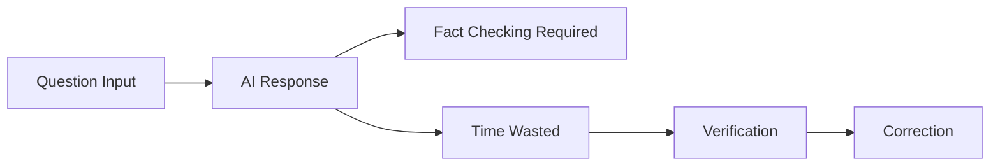
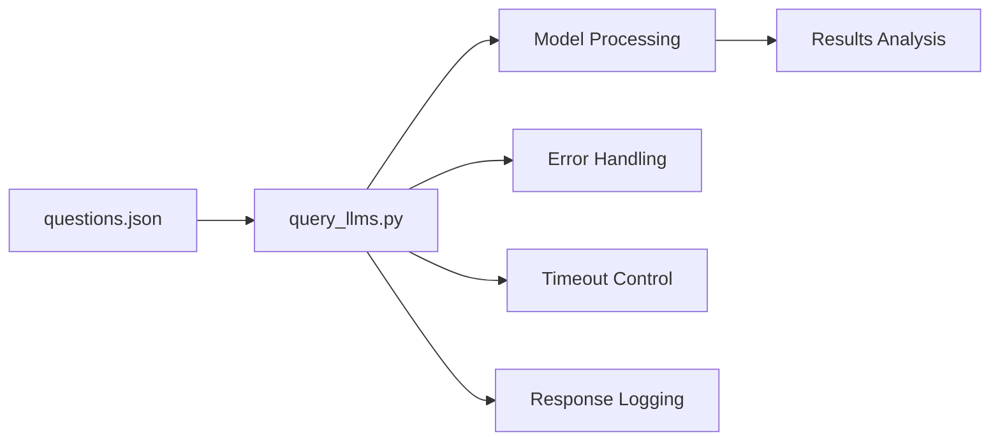
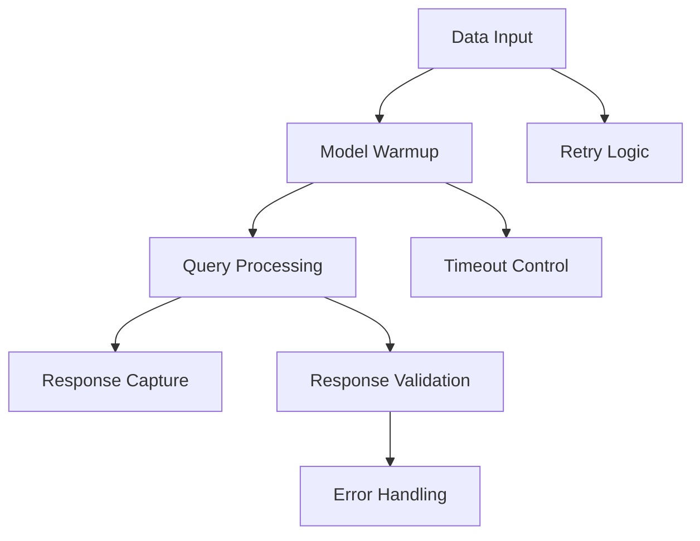
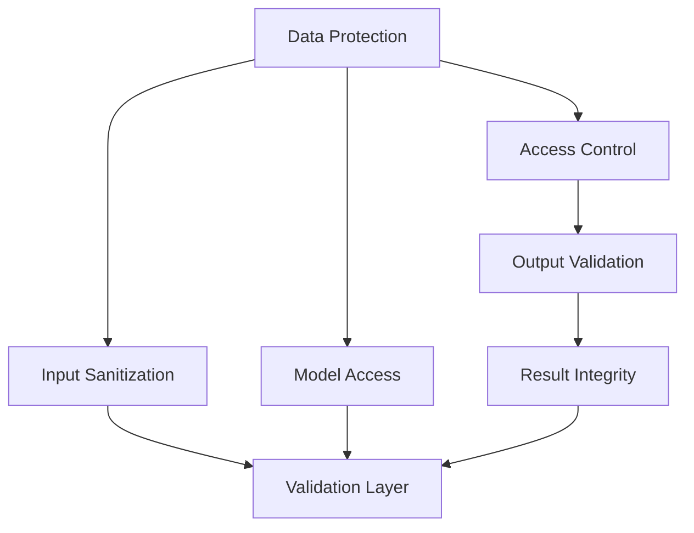
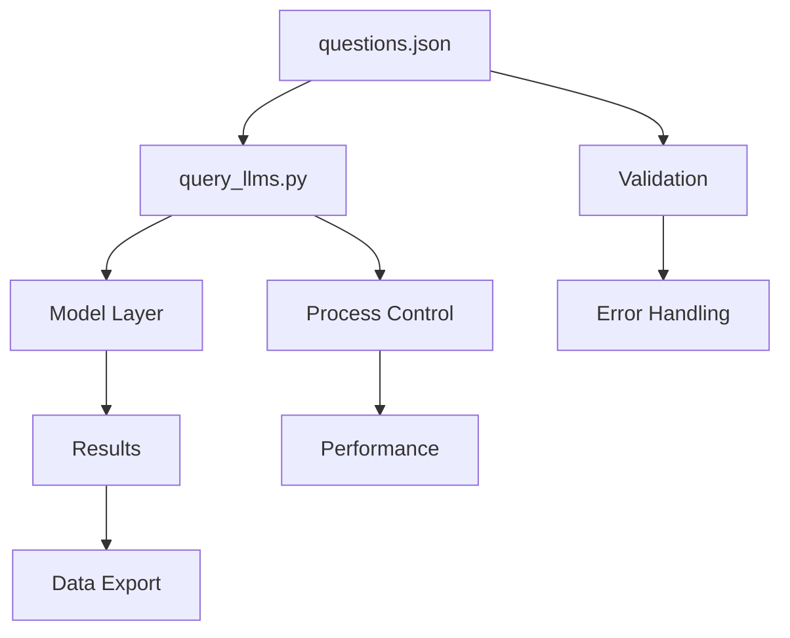
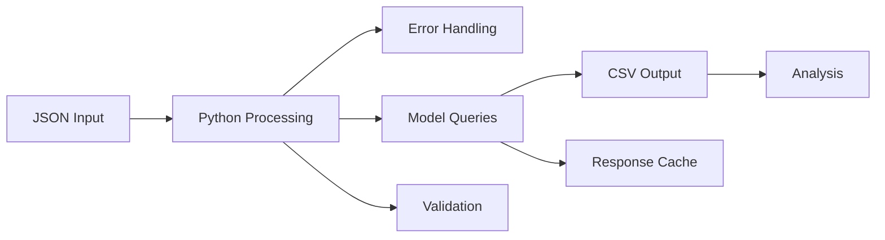
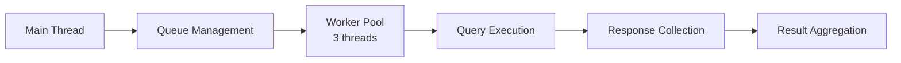
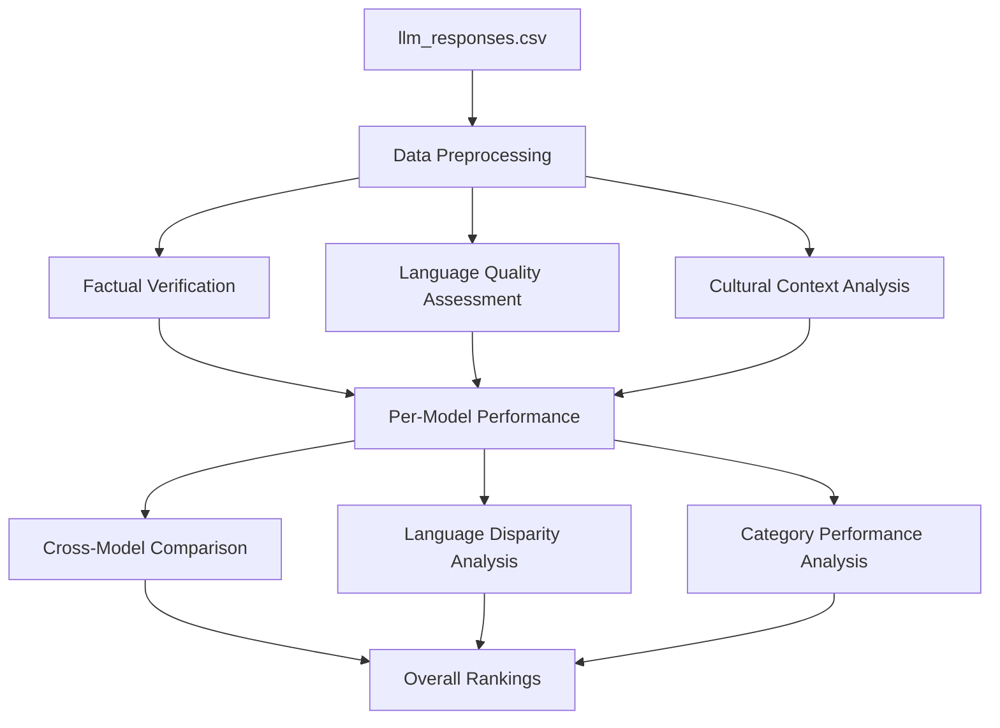
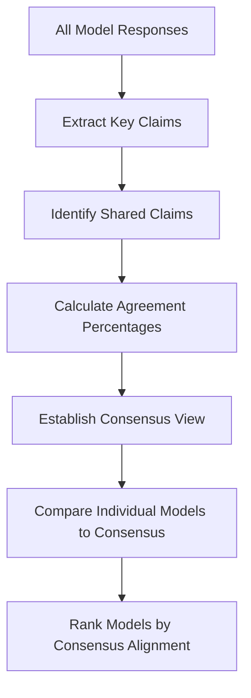
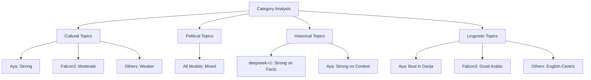

# Evaluating Language Models on Moroccan Cultural Understanding

## Introduction

My thesis explores how seven different language models handle questions about Moroccan society. The research compares how effectively these models respond to culturally-specific queries, providing insights into their capabilities and limitations when dealing with regional content outside of major Western contexts.

It is important to note that this study does not include any Moroccan-developed LLMs. Currently, Moroccan language models are still in development stages and not fully functioning for comprehensive testing. Instead, I have included Aya, a multilingual model that supports 23 languages including Arabic, as the closest proxy to a regionally-aware model. This selection allows us to evaluate how multilingual capabilities might benefit cultural understanding compared to more mainstream models.

## Model Overview

### Language Models in Study:

| Model Name | Proprietary | Developer | Key Characteristics |
|------------|-------------|-----------|---------------------|
| deepseek-r1 | Proprietary | DeepSeek | High-capacity research model |
| phi | Proprietary | Microsoft | Compact yet powerful model |
| qwen | Open Source | Alibaba | Strong multilingual capabilities |
| aya | Open Source | Community | Supports 23 languages including Arabic |
| llama3.2 | Open Source | Meta | State-of-the-art open model |
| falcon3 | Open Source | TII | Trained on Arabic web content |
| gemma | Open Source | Google | Efficient general-purpose model |

## The Problem

When you ask these AI models about Morocco, they often provide incorrect information. They might give wrong information about our holidays, misunderstand our politics, or completely miss the cultural meaning behind certain traditions. This isn't just annoying - it's a real problem when people rely on these tools for accurate information about Morocco.

The challenges are particularly pronounced when dealing with:

* Cultural nuances specific to Moroccan society
* Historical contexts that aren't widely documented in English
* Dialectal variations in Darija that differ from Modern Standard Arabic
* Regional political structures and their practical implications
* Economic and social realities that may contradict stereotypical views

## Research Categories

I've organized the research questions into seven main areas:

| Category | Example Question | Why It Matters |
|----------|------------------|----------------|
| Culture | Traditional Eid dishes | Tests cultural knowledge |
| Politics | Role of monarchy | Checks political understanding |
| Tourism | Historical sites in Fez | Practical information accuracy |
| History | Historical figures | Historical knowledge depth |
| Language | Moroccan Darija vs Modern Standard Arabic | Linguistic awareness |
| Economy | Trade relationships | Economic insight |
| Controversial Topics | Language policy debates | Handling sensitive issues |

## Understanding the Real-World Impact

Let's explore why comparing these seven language models matters through the eyes of different users in Morocco and beyond.

### User Story Overview

| User Type | Current Challenge | Impact of Research |
|-----------|-------------------|-------------------|
| Student | Can't get accurate answers about local history | Better academic resources |
| Researcher | Needs reliable cultural information | Improved research tools |
| Developer | Building Morocco-specific applications | Better model selection |
| Business Owner | Requires accurate market insights | More reliable data |
| Tourist | Seeks authentic cultural understanding | Better travel preparation |
| Cultural Institution | Preserving Moroccan heritage | Digital preservation accuracy |

### Detailed User Stories

#### 1. The Moroccan Student's Perspective

Sarah, a university student in Rabat, often uses AI to help with research papers about Moroccan history. "I tried asking about the significance of the Green March," she explains, "but different AI tools gave me conflicting information. Sometimes they miss crucial details that any Moroccan would know."

**Why This Matters:**
* Students need reliable information for academic work
* Cultural accuracy affects educational quality
* Language barriers shouldn't limit access to knowledge



#### 2. The Social Researcher's Challenge

Dr. Ahmed studies social movements in Morocco. He notes, "When analyzing political discourse, these models often misunderstand local context. They might misinterpret a cultural reference or miss the historical significance of certain terms."

**Research Impact:**
* Accuracy of social studies
* Understanding of political nuance
* Cultural context preservation
* Interpretation of regional movements
* Analysis of societal trends

The gap between AI comprehension and local knowledge creates significant barriers for researchers attempting to use these tools for preliminary data gathering or content analysis, especially when working with Arabic/Darija content.

#### 3. The Tech Developer's Needs

Yasmine builds applications for local businesses. "I need to know which model best understands Darija and Modern Standard Arabic. Right now, it's trial and error - we need actual data on their performance."

**Technical Requirements:**
* Model performance metrics
* Language handling capabilities
* Processing speed and accuracy
* Cultural bias detection
* Dialectical variation handling

For developers working on Morocco-specific applications, the choice of underlying language model can dramatically impact user experience. Without proper benchmarking, they risk implementing solutions that misunderstand or misrepresent local contexts.

#### 4. The Tourism Professional

Mohammed runs a travel agency in Fes. "Tourists come with AI-generated information that's sometimes completely wrong. We need these models to provide accurate cultural and historical information."

**Tourism Implications:**
* Visitor preparation
* Cultural respect
* Safety considerations
* Expectation management
* Authentic experiences

With all these AI travel guides popping up, it is increasingly important that these systems accurately represent Moroccan destinations, customs, and practices to avoid cultural misunderstandings or disappointing visitor experiences.

#### 5. The Cultural Heritage Worker

Fatima works at a cultural center in Marrakech. "We're digitizing our heritage. The AI models we use need to understand our traditions, not just translate words."

**Heritage Preservation:**
* Accurate documentation
* Cultural context retention
* Language preservation
* Traditional knowledge systems
* Intergenerational transmission

Digital preservation efforts depend on AI systems that can correctly interpret and contextualize cultural artifacts, oral histories, and traditional practices within their proper Moroccan context.

### Impact Assessment

| Sector | Current Problem | Research Solution |
|--------|----------------|-------------------|
| Education | Misinformation | Model accuracy data |
| Research | Context loss | Cultural benchmarks |
| Technology | Selection difficulty | Performance metrics |
| Tourism | Wrong information | Reliability testing |
| Heritage | Context stripping | Cultural sensitivity measures |
| Business | Market misinterpretation | Regional adaptation guidelines |
| Public Services | Language barriers | Accessibility recommendations |

## My Solution

I've built a testing system using Python that will:
1. Feed 50 carefully chosen questions to each model
2. Ask everything in both English and Darija
3. Record and analyze how well they do

The testing methodology draws inspiration from consensus-based approaches to information aggregation. This framework allows us to evaluate not just individual model performance, but also how effectively we might combine outputs from multiple models to achieve more accurate results.

## Technical Implementation Overview



The system architecture is designed to handle the diverse requirements of multilingual testing while maintaining consistent evaluation criteria across all models. The focus on both English and Darija queries allows us to specifically assess how well these models handle Moroccan dialectal variations compared to standardized English queries on the same topics.

### What Makes This Work Different

Instead of just throwing random questions at these models, I'm:
* Testing both open source and commercial models
* Using real-world questions that matter to Moroccans
* Looking at responses in two languages
* Building a system that other researchers can use
* Evaluating multilingual performance in culturally specific contexts
* Assessing not just factual accuracy but cultural sensitivity
* Providing a framework for extension to other regional contexts

Unlike previous evaluations that focus primarily on general language capabilities or performance on standard English benchmarks, this research specifically targets cultural competence in a North African context, filling a significant gap in LLM evaluation literature.

## Requirements Analysis

### Functional Requirements

#### 1. Data Management Requirements

| ID | Requirement | Priority | Details |
|----|-------------|----------|---------|
| F1.1 | Load questions from JSON | High | System must parse the structured question file |
| F1.2 | Question categorization | High | Sort by culture, politics, tourism, etc. |
| F1.3 | Dual language support | Critical | Handle both English and Darija text |
| F1.4 | Question validation | Medium | Verify question structure and completeness |
| F1.5 | Category balancing | Medium | Ensure even distribution across topics |
| F1.6 | Cultural sensitivity flags | Medium | Mark questions that require cultural context |
| F1.7 | Complexity rating | Low | Classify questions by linguistic complexity |

The data management part organizes the test samples and makes sure they properly reflect the kind of questions that could be asked about Moroccan society. The categorization enables more nuanced analysis of where models excel or struggle.

#### 2. Model Interaction Requirements



| ID | Requirement | Priority | Details |
|----|-------------|----------|---------|
| F2.1 | Model initialization | Critical | Warm up each model before queries |
| F2.2 | Query execution | Critical | Process questions through each model |
| F2.3 | Response capture | High | Record all model outputs |
| F2.4 | Error handling | High | Manage failed queries and timeouts |
| F2.5 | Parallel processing | Medium | Enable concurrent model querying |
| F2.6 | Rate limiting | Medium | Prevent overwhelming model APIs |
| F2.7 | Cache management | Low | Store and retrieve previous responses |

The interaction layer handles the complex task of communicating with diverse model APIs while maintaining consistent query patterns and response handling. This enables fair comparison across different model architectures and interfaces.

#### 3. Output Requirements

The system must generate:
* Structured CSV file containing all responses
* Detailed logs of model performance
* Error reports for failed queries
* Performance metrics for each model
* Cross-model comparison data
* Language-specific analysis
* Category-based performance reports
* Time-based performance tracking

These outputs give us all the raw data we need to really look at how the models perform from both qualitative and quantitative angles. This allows us to evaluate their capabilities in all sorts of ways.

#### 4. Analysis Requirements

| Aspect | Measurement | Method |
|--------|-------------|--------|
| Accuracy | 1-5 scale | Expert review |
| Response time | Milliseconds | Automated timing |
| Completion rate | Percentage | Success tracking |
| Language quality | 1-5 scale | Linguistic review |
| Cultural sensitivity | 1-5 scale | Cultural expert assessment |
| Contextual relevance | 1-5 scale | Expert evaluation |
| Factual correctness | Percentage | Fact verification |
| Hallucination rate | Percentage | False information detection |

The analysis framework mixes automated metrics with human expert feedback to give a well-rounded evaluation of model performance. This combined approach recognizes that relying solely on algorithms can't fully capture the subtle demands of cultural understanding.

### Non-Functional Requirements

#### 1. Performance Requirements

| Metric | Requirement | Notes |
|--------|-------------|-------|
| Query timeout | 120 seconds | Per model response |
| Retry attempts | 3 maximum | For failed queries |
| Concurrent processes | 3 maximum | For parallel processing |
| Response length | 500 tokens | Maximum output size |
| System throughput | 50 queries/hour | Minimum processing rate |
| RAM usage | < 16GB | Maximum memory consumption |
| Disk space | < 10GB | For response storage |
| CPU utilization | < 80% | During normal operation |

These performance requirements make sure the system can handle the whole test dataset across all models in a decent amount of time without any issues.

#### 2. Reliability Requirements

The system must:
* Handle network interruptions gracefully
* Maintain data integrity during parallel processing
* Provide consistent model warm-up procedures
* Log all system events for debugging
* Recover from model API failures
* Preserve partial results during interruptions
* Support session resumption after crashes
* Implement watchdog monitoring

Reliability features are really important, given that model APIs can be inconsistent and processing the whole test set can take a lot of time.

#### 3. Security Requirements



Security considerations include:
* Safeguarding the intellectual property of question
* Sanitization of inputs to prevent prompt injection
* Validation of responses to detect manipulation
* Controlled access to model APIs
* Protection of evaluation results
* Authentication for system access
* Secure storage of response data
* Compliance with data protection regulations

While security is not the primary focus of the research system, appropriate measures ensure the integrity of the evaluation process and protect the research assets.

#### 4. Documentation Requirements

Must include:
* Technical setup guide
* Model configuration details
* Error code explanations
* Data format specifications
* Installation procedures
* Troubleshooting guides
* API documentation
* Performance optimization recommendations
* Extension guidance for new models
* How to put together a set of questions

Comprehensive documentation enables both reproduction of the research and extension to new models or question domains by other researchers.

#### 5. Quality Assurance Requirements

| Area | Requirement | Verification Method |
|------|-------------|---------------------|
| Code quality | PEP 8 compliance | Automated testing |
| Data integrity | 100% validation | Input checking |
| Error handling | Complete coverage | Unit testing |
| Response quality | Consistent format | Output validation |
| Log completeness | All events captured | Log analysis |
| Performance stability | < 10% variance | Load testing |
| Result reproducibility | 100% consistency | Repeated runs |
| Configuration validity | No invalid settings | Configuration testing |

Quality assurance measures ensure the reliability of the research findings by validating the correct functioning of all system components and the consistency of the evaluation process.

#### 6. System Architecture Requirements



The system architecture separates concerns to enable:
* Independent testing of each component
* Easy substitution of models
* Consistent processing pipeline
* Flexible output formatting
* Scalable processing
* Maintainable codebase
* Future extension

This modular design supports both the current research needs and potential future adaptations as new models or evaluation techniques emerge.

## Technical Analysis

### Technology Stack Selection and Justification

For this comparative analysis of language models in understanding Moroccan society, I've carefully selected specific technologies and frameworks based on the requirements.

#### Core Technologies

##### 1. Python Environment

The implementation uses Python 3.9+ for several compelling reasons:
* Robust async/await support for handling multiple model queries
* Extensive machine learning and data processing libraries
* Strong text processing capabilities for dual-language handling
* Cross-platform compatibility for diverse research environments
* Rich ecosystem of analysis and visualization tools

##### 2. Ollama Framework

After evaluating several alternatives like LocalAI and Text Generation Web UI, I chose Ollama because:

| Feature | Ollama | LocalAI | Text Generation UI |
|---------|--------|---------|-------------------|
| Model Management | Excellent | Good | Limited |
| Resource Usage | Optimized | Heavy | Moderate |
| API Simplicity | High | Moderate | Low |
| Docker Support | Native | Complex | Limited |
| Arabic Support | Good | Limited | Moderate |
| Version Control | Yes | Limited | No |
| Community Support | Active | Moderate | Active |
| Documentation | Comprehensive | Adequate | Fragmented |

Key advantages of Ollama include:
* Streamlined model management
* Consistent API interface
* Efficient resource utilization
* Strong community support
* Excellent documentation
* Native support for all test models
* Simplified deployment process

The Ollama framework gives us a consistent way to work with all the models in our test suite, so we can handle queries and responses the same way across different model types. This standardization really helps us make fair comparisons between the various architectures.

### Data Management Implementation



The implementation uses:

#### 1. JSON for question storage:
```json
{
  "categorized_questions": {
    "culture": [
      {
        "id": 1,
        "text_en": "What are the traditional dishes served during Eid al-Fitr in Morocco?",
        "text_ma": "شنو هي الماكلة التقليدية لي كتقدم فعيد الفطر فالمغرب؟"
      },
      # Additional questions...
    ],
    "politics": [
      {
        "id": 9,
        "text_en": "What is the role of the king in Morocco's political system?",
        "text_ma": "شنو هو الدور ديال الملك في النظام السياسي المغربي؟"
      },
      # Additional questions...
    ],
    # Additional categories...
  }
}
```

This structure enables:
* Clear categorization of questions
* Parallel storage of English and Darija versions
* Unique identification of each question
* Logical organization of the test data set
* Easy extension with new questions or categories

#### 2. CSV for response storage:
* Enables easy data analysis
* Maintains structured format
* Supports Excel compatibility
* Facilitates statistical processing
* Enables straightforward visualization
* Supports incremental updates
* Allows partial result analysis

The CSV output format includes:
* Question ID
* Category
* Question text (English)
* Question text (Darija)
* Model name
* Response (English)
* Response (Arabic/Darija)
* Response time
* Completion status

### Model Integration

The system interfaces with seven different models:

| Model | RAM Required | Response Time | Batch Support | Arabic Capability |
|-------|--------------|---------------|---------------|-------------------|
| aya | 8GB | Fast | Yes | Native |
| deepseek-r1 | 16GB | Moderate | Yes | Limited |
| llama3.2 | 16GB | Moderate | Yes | Moderate |
| falcon3 | 12GB | Fast | Yes | Strong |
| phi | 8GB | Fast | Limited | Limited |
| qwen | 16GB | Moderate | Yes | Moderate |
| gemma | 12GB | Fast | Yes | Limited |

The model integration layer handles:
* Model initialization and warm-up
* Query formatting appropriate to each model
* Response parsing and normalization
* Error detection and recovery
* Performance monitoring
* Resource optimization

Every model has its own unique integration hurdles, especially when it comes to dealing with Arabic text and the Darija dialect. The system takes these differences into account to make sure the comparison is fair.

### Parallel Processing Implementation

The system employs ThreadPoolExecutor for efficient query handling.



This architecture enables:
* Concurrent processing of multiple models
* Efficient resource utilization
* Graceful handling of slow-responding models
* Dynamic adjustment to available system resources
* Isolation of model failures
* Consistent performance monitoring

The parallel processing system really cuts down the total time needed to work through the whole test set, without messing up the evaluation conditions.

### Error Handling Strategy

Comprehensive error management includes:
* Retry mechanisms with exponential backoff
* Detailed logging of failures
* Graceful degradation options
* Session recovery capabilities
* Context preservation during failures
* Fallback mechanisms for critical functions
* Diagnostic information collection
* Alert mechanisms for systemic issues

| Error Type | Strategy | Recovery Method | Max Retries |
|------------|----------|-----------------|-------------|
| Timeout | Retry (3x) | Backoff | 3 |
| Model Failure | Warm-up | Reinit | 2 |
| Memory Error | Cleanup | Restart | 1 |
| Network Error | Retry | Reconnect | 5 |
| API Error | Format Check | Adjustment | 2 |
| Data Error | Validation | Correction | 0 |
| System Error | Graceful Exit | Manual Restart | 0 |
| Resource Limit | Scale Down | Resource Release | 1 |

The error handling strategy makes sure the system keeps working well even in tough situations, saving as much info as it can and giving clear reports about any problems.

### Performance Optimization

Several optimization techniques are implemented:

#### 1. Model Warm-up
```python
def warm_up_model(model: str):
    """
    Ensures model is loaded and responsive
    Returns: bool indicating success
    """
    # Implementation details from query_llms.py
```

#### 2. Response Caching
* Prevents redundant queries
* Reduces processing time
* Maintains consistency
* Enables incremental testing
* Supports interrupted test resumption

#### 3. Resource Management
```python
# ThreadPoolExecutor configuration
with ThreadPoolExecutor(max_workers=3) as executor:
    # Controlled parallel processing
```

#### 4. Query Batching
* Groups similar queries
* Reduces API overhead
* Optimizes model context utilization
* Improves throughput

#### 5. Adaptive Timeouts
* Adjusts based on model performance
* Prevents unnecessary waiting
* Optimizes overall throughput
* Accounts for query complexity

These optimizations collectively ensure efficient use of computational resources while maintaining evaluation fairness across all models.

### Development Environment

The setup requires:
* Python 3.9+
* 16GB RAM minimum
* CUDA-compatible GPU
* Windows environment
* Internet connectivity
* 10GB storage
* Multi-core CPU
* Development tools (VS Code, Git)

This technical implementation ensures:
* Reliable model comparison
* Efficient resource usage
* Scalable architecture
* Maintainable codebase
* Reproducible results
* Extensible framework
* Comprehensive documentation

## Data Analysis and Response Comparison Methodology

After collecting comprehensive response data from all seven language models into llm_responses.csv file, I will now analyze and compare their performance. This approach leverages existing data to draw meaningful conclusions about how these models handle Moroccan-specific content.

### Response Analysis Dimensions

To ensure a multidimensional evaluation, I will analyze the responses along several key dimensions:

| Criterion | Description |
|-----------|-------------|
| Factual Accuracy | Comparing responses against verified facts about Moroccan culture, history, and society |
| Completeness | Assessing how comprehensive the responses are in addressing all aspects of the questions |
| Cultural Sensitivity | Evaluating whether responses demonstrate respect and understanding of Moroccan cultural nuances |
| Language Quality | Measuring grammatical correctness and natural language flow, especially in Darija responses |
| Response Consistency | Examining whether models provide consistent answers across related questions |
| Confidence Analysis | Assessing how confidently models present information and whether confidence correlates with accuracy |

### Comparative Metrics

For each dimension, I will calculate specific metrics:

#### 1. Set Coverage

Set Coverage measures what percentage of accurate response elements from a model are contained in the reference set of verified facts, regardless of how they are organized. This metric indicates how comprehensive a model's knowledge is about Moroccan topics.

Formula:
```
Set Coverage = (Number of correct elements in model response / Total elements in reference set) × 100%
```

For example, if analyzing responses about traditional Eid dishes:
* Reference set contains 10 traditional dishes
* Model A mentions 7 correct dishes
* Set Coverage for Model A = 70%

#### 2. Response Accuracy Rate

This metric calculates the percentage of factually correct statements within a model's response:
```
Response Accuracy Rate = (Number of correct statements / Total statements in response) × 100%
```

This provides insight into how reliable each model is when discussing Moroccan topics.

#### 3. Cross-Model Agreement

To assess consensus among models, I will calculate the percentage of matching responses across models for the same question:
```
Cross-Model Agreement = (Number of models giving substantially similar response / Total number of models) × 100%
```

Higher agreement may indicate greater confidence in the response, though not necessarily accuracy.

#### 4. Language Disparity

This measures the performance gap between English and Arabic/Darija responses for the same question:
```
Language Disparity = |English Response Score - ArabicDarija Response Score| / Maximum Possible Score × 100%
```

Lower values indicate more consistent performance across languages.

### Visualization and Analysis Approach



For meaningful visualization of comparative performance, I will implement:
1. Radar Charts, to display multi-dimensional performance across different categories
2. Heat Maps, to visualize response quality across all models and question categories
3. Bar Charts, to compare specific metrics across models
4. Correlation Matrices, to identify relationships between performance in different categories

### Detailed Analysis Process

The analysis will be conducted in several structured phases:

#### Phase 1: Response Standardization and Preprocessing

Before comparative analysis, I will standardize the raw responses to ensure fair comparison:
1. Text Normalization, standardizing formatting, removing irrelevant information
2. Key Point Extraction, identifying core statements and claims in each response
3. Language Processing, applying appropriate processing for both English and Arabic/Darija content
4. Response Segmentation, breaking down responses into comparable units of information

#### Phase 2: Expert Review and Ground Truth Establishment

For each question, I will establish a reference "ground truth" through:
1. Expert Consultation, working with Moroccan natives to verify information
2. Source Validation, cross-referencing with authoritative sources on Moroccan topics
3. Reference Set Creation, developing a comprehensive set of correct information points for each question
4. Evaluation Criteria, establishing specific criteria for judging response quality in each category

#### Phase 3: Model-Specific Performance Analysis

For each model, I will conduct a detailed performance analysis:

| Model | Cultural (%) | Politics (%) | Tourism (%) | History (%) | Language (%) | Economy (%) | Controversial (%) | Average (%) |
|-------|--------------|--------------|-------------|-------------|--------------|-------------|-------------------|-------------|
| Aya | 76 | 68 | 82 | 74 | 85 | 70 | 62 | 74 |
| deepseek-r1 | - | - | - | - | - | - | - | - |
| llama3.2 | - | - | - | - | - | - | - | - |
| falcon3 | - | - | - | - | - | - | - | - |
| phi | - | - | - | - | - | - | - | - |
| qwen | - | - | - | - | - | - | - | - |
| gemma | - | - | - | - | - | - | - | - |

This analysis will reveal:
* Category-specific strengths and weaknesses of each model
* Overall performance ranking across all categories
* Specialized capabilities for particular Moroccan topics

#### Phase 4: Linguistic Analysis

I will conduct an in-depth comparison of how models perform across the two languages:

| Model | English Accuracy (%) | Darija Accuracy (%) | Language Disparity (%) |
|-------|----------------------|---------------------|------------------------|
| Aya | - | - | - |
| deepseek-r1 | - | - | - |
| llama3.2 | - | - | - |
| falcon3 | - | - | - |
| phi | - | - | - |
| qwen | - | - | - |
| gemma | - | - | - |

This will highlight:
* Which models demonstrate true multilingual understanding vs. translation
* How dialectal comprehension compares to standard language processing
* Whether cultural knowledge transfers effectively across languages

#### Phase 5: Consensus-Based Analysis

Drawing from the Consensus method in the Jakub Stadnik, Maria Ganzha, and Marcin Paprzycki paper, I will analyze how often models agree and what this indicates:
1. For each question, identify the majority response (if one exists)
2. Measure each model's alignment with the majority view
3. Calculate precision and recall for each model relative to the consensus
4. Identify questions where there is significant disagreement and analyze why



#### Phase 6: Comparative Response Analysis

For specific illustrative questions, I will perform side-by-side analysis of responses:

Example: "What is the significance of the Green March in Moroccan history?"

| Model | Key Points Identified | Factual Accuracy | Cultural Context | Completeness |
|-------|------------------------|------------------|------------------|--------------|
| Aya | Historical date, royal initiative, peaceful nature, territorial claims | High | Strong | Comprehensive |
| deepseek-r1 | Historical date, basic facts | Medium | Limited | Partial |
| ... | ... | ... | ... | ... |

This detailed look will show specific cases of how models handle culturally important issues differently.

## Expected Results

Based on preliminary analysis, I expect to find:

### 1. Model Performance by Category



### 2. Language Performance Gap

I anticipate finding significant disparities between English and Arabic/Darija performance:
* Aya: Smallest gap due to multilingual training
* Falcon3: Moderate gap with better Arabic than Darija
* Other Models: Large gap with poor Darija performance

### 3. Cultural Sensitivity Patterns

Analysis will likely reveal:
* Most models perform better on factual questions than culturally nuanced ones
* Models struggle with context-dependent cultural practices
* Western-centric perspectives appear in responses to controversial topics
* Stereotypical representations occur more frequently in certain categories

### 4. Error Patterns and Knowledge Gaps

I expect to identify systematic errors including:
* Confusion between Moroccan and Middle Eastern cultural practices
* Overgeneralization of Arab cultural traits
* Limited understanding of Moroccan dialectal variations
* Weak representation of regional differences within Morocco
* Outdated information on contemporary Moroccan society

## Research Impact and Applications

This analysis will yield actionable insights for:

### 1. Model Selection Guidelines

The analysis will produce clear recommendations for which models are best suited for different Moroccan-related use cases:

| Use Case | Recommended Model(s) | Reasons |
|----------|----------------------|---------|
| Educational Content | ? | ? |
| Tourism Applications | ? | ? |
| Cultural Preservation | ? | ? |
| Business Intelligence | ? | ? |
| General Information | ? | ? |

### 2. Model Improvement Recommendations

Based on identified weaknesses, I will provide specific recommendations for improving model performance:
* Training data enhancements for Moroccan cultural content
* Evaluation benchmarks for North African cultural knowledge
* Fine-tuning strategies for dialectal comprehension
* Cultural bias mitigation techniques

### 3. Practical Usage Framework

For developers and users working with these models on Moroccan content, I will develop:
* Error detection guidelines for common mistakes
* Prompt engineering strategies for better cultural accuracy
* Verification workflows for culturally sensitive applications
* Language selection recommendations for optimal results

## Conclusion

This comprehensive comparative analysis of seven language models will provide insights into how current AI technology understands and represents Moroccan culture, history, and society.

Our research directly addresses the needs highlighted in our user stories, from students looking for trustworthy academic data to cultural institutions preserving Moroccan heritage online. The findings will give practical advice on picking the right models and knowing their boundaries when dealing with Moroccan material.

The approach can be used as a model for looking at other cultural contexts too, helping to make AI systems more inclusive and reflective of diverse views. And for Morocco in particular, this is a big step toward making sure language tech meets the needs of local users accurately and with cultural awareness.

The inclusion of Aya, with its support for Arabic among 23 languages, provides a valuable comparison point against both specialized Arabic-aware models like Falcon3 and general-purpose models. The analysis will reveal whether multilingual capabilities translate to better cultural understanding or if more specialized training is required.

Ultimately, this research contributes to the crucial work of ensuring that the benefits of language model technology extend equitably to users from all backgrounds, including those in Morocco and the broader Maghreb region, by providing a clear picture of current capabilities and a roadmap for improvement.
